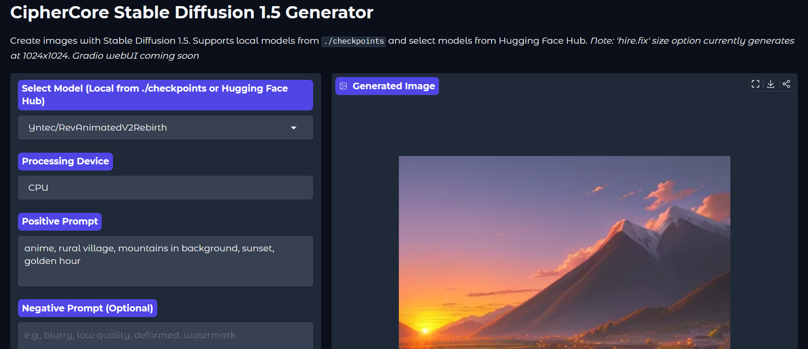

#  11-06-2025 UPDATE:
**🌟 Model Storage Update for CipherCore 🌟**

Great news for portability and model organization!

CipherCore will now download and store all Hugging Face Hub models directly into the `checkpoints` folder within the application's main directory.

**What this means for you:**
*   **Complete Portability:** The app and its models are now fully self-contained. Move the CipherCore folder, and your models go with it!
*   **Dedicated Model Storage:** Models downloaded by this app will no longer be placed in your global Hugging Face cache directory (typically found in your user folder).

**Note:** This change applies to models downloaded by this version of CipherCore onwards. Models already in your global Hugging Face cache will not be automatically moved.


# CipherCore SD1.5 - FAST Stable Diffusion 1.5 Local Image Generator Web UI (CPU & GPU)
[](https://www.python.org/downloads/)  
[](https://opensource.org/licenses/MIT)

Welcome to the CipherCore Stable Diffusion 1.5 Generator! This user-friendly Gradio web application allows you to effortlessly generate images using various Stable Diffusion 1.5 models for free locally on your own PC. Whether you have local models or prefer popular ones from the Hugging Face Hub, this tool provides a simple interface to unleash your creativity on your CPU or GPU.

This project is designed for **Windows** users seeking a simple experience through easy-to-use batch files, as well as providing manual setup options for other platforms or advanced users who enjoy a bit of pain.

## Application Screenshot:


---

## ✨ Features
- **Flexible Model Selection:**
  - Load your own Stable Diffusion 1.5 models (in `diffusers` format) from a local `./checkpoints` directory.
  - Access a curated list of popular SD1.5 models directly from the app (models are downloaded and cached locally on first use).
- **Device Agnostic:**
  - Run inference on your **CPU**. (inference time around 4:55 with 10th gen i5 — not bad for an oven).
  - Leverage your **NVIDIA GPU** for significantly faster generation (Euler 30 steps = 8 secs with 6GB VRAM). CUDA magic required.
- **Comprehensive Control:**
  - **Positive & Negative Prompts:** Guide the AI with detailed descriptions of what you want (and don’t want).
  - **Inference Steps:** Control the number of denoising steps, because 20 just doesn’t feel lucky enough sometimes.
  - **CFG Scale:** Adjust how strongly the image should conform to your prompt — or not. Live a little.
  - **Schedulers:** Experiment with different sampling algorithms (Euler, DPM++ 2M, DDPM, LMS) until you find your personal flavor of chaos.
  - **Image Sizes:** Choose from standard SD1.5 resolutions, plus a "hire.fix" option (interpreted as 1024x1024 because that's what people usually mean anyway).
  - **Seed Control:** Set a specific seed for reproducible results. Or use -1 and see what the universe decides.
- **User-Friendly Interface:**
  - Clean and intuitive Gradio UI.
  - Organized controls with advanced settings tucked away neatly — like secrets.
  - Direct image display with download and share options.
- **Safety First (Note):** The built-in safety checker is **disabled** in this version to allow for maximum creative freedom. Use responsibly. (We see you.)

---

## 🔥 Why CipherCore?
Unlike some other UIs (*cough* Forge), **CipherCore is built for speed** — and not just on paper.

In a direct head-to-head test using **Stable Diffusion 1.5**, with the **same model**, **same settings**, **same seed**, and on the **same CPU-only machine**:

| Web UI         | Steps | Scheduler | Time per Step | Total Time |
|----------------|-------|-----------|----------------|-------------|
| **CipherCore** | 20    | Euler     | 20.72 sec      | **6:54**     |
| **Forge**      | 20    | Euler     | 34.78 sec      | **11:35**    |

That’s nearly **twice as fast** — and without sacrificing your machine to the arcane gods of Python overhead.

CipherCore is **heavily optimized** for both CPU and GPU environments:  
- Lean startup and efficient memory usage.  
- Clean Gradio architecture with no background bloat or unnecessary jazz.  
- Lightning-fast local caching and model handling.  
- Optimized for low-VRAM systems (especially on GPU). Yes, even your poor 6GB card.

Expect even better results on GPU — actual benchmarks coming soon, pending the availability of a GPU that hasn’t been hijacked by miners or gamers.

---

## 🚀 Prerequisites
- **Windows Operating System:** The provided batch files (`.bat`) are for Windows. For other operating systems, follow the manual setup steps below (warning: includes actual typing).
- **Python:** 3.8 or higher. Ensure Python is installed and added to your system's PATH (usually an option during installation). You can download Python from [https://www.python.org/downloads/windows/](https://www.python.org/downloads/windows/).
- **Git:** (Required for manual setup and updating) For cloning the repository.
- **Hardware:**
  - A modern CPU is required.
  - For GPU acceleration (optional but highly recommended for speed), a compatible NVIDIA GPU with up-to-date CUDA drivers. At least 6–8GB VRAM is recommended for 512x512 generation, more for larger sizes.
  - **Important:** The correct CUDA version for your drivers is critical. Use `nvidia-smi` in the command prompt to check your driver's compatible CUDA version. Or guess wildly — up to you.
- **Internet Connection:** Required for downloading models from Hugging Face Hub and for updates. Sorry, it doesn't generate dreams offline (yet).

---

## 📦 Easy Setup (Windows - Download & Run)
This is the recommended method for most Windows users. **Two separate setup scripts are provided:** one for CPU inference and one for GPU inference.

1. **Download the project:**
   - Go to the GitHub repository page: `https://github.com/Raxephion/CipherCore-WebUI`
   - Click the green "Code" button.
   - Click "Download ZIP".
2. **Extract the ZIP:** Extract the downloaded ZIP file to a location on your computer (e.g., your Documents folder or Desktop). This will create a folder like `CipherCore-SD1.5-Image-Generator-main` (or similar). Rename it if you feel fancy.
3. **Choose Your Setup Script:**
   - **For CPU Inference:** Run `setup-CPU.bat`. This will install the CPU version of PyTorch.
   - **For GPU Inference:** Run `setup-GPU.bat`. This will attempt to install the CUDA-enabled version of PyTorch.
4. **Run the Setup Script:**
   - Navigate into the extracted folder.
   - **Double-click either `setup-CPU.bat` or `setup-GPU.bat`** depending on whether you want CPU or GPU inference.
   - A command prompt window will open. Follow the instructions in the window. This script will create a Python virtual environment (`venv`), install all necessary core dependencies, and install the appropriate version of PyTorch.
   - **Important:** Read the output in the command prompt carefully during and after the script finishes.
     - **If using `setup-GPU.bat` and the CUDA installation fails:** The script will provide instructions on how to troubleshoot the CUDA installation or how to install the CPU version of PyTorch as a fallback. There's no shame in going back to CPU. Okay, maybe a little.
5. **Prepare Local Models (Optional):**
   - Inside the extracted project folder, create a directory named `checkpoints` (if the setup script didn’t create it).
   - Place your Stable Diffusion 1.5 models (in `diffusers` format – each model is a folder containing files like `model_index.json`, `unet/`, `vae/`, etc.) inside the `checkpoints` directory.

---

## 🔄 Updating the Application (Windows - Easy Method)
To get the latest code, dependency updates and updated models from this repository after using the easy setup:
- Navigate to the project folder.
- Double-click `update.bat` to run it.
- A command prompt window will open and pull the latest changes from the GitHub repository and upgrade the Python packages in your virtual environment. Congratulations, you are now slightly more modern.

---

## ▶️ Running the Application (Windows - Easy Method)
Once the setup is complete, launch the Gradio web UI by double-clicking the `run.bat` file in the project folder.
- A command prompt window will open, activate the environment, and start the application.
- A browser window should automatically open to the application (or a local URL will be provided in the console, usually `http://127.0.0.1:7860`).
- If nothing happens: check your firewall, your antivirus, and your life choices.

---

## ⚙️ Manual Setup (Windows - Git Clone)
1. **Clone the Repository:**
   ```bash
   git clone https://github.com/Raxephion/CipherCore-SD1.5-Image-Generator-.git
   cd CipherCore-SD1.5-Image-Generator-
   ```
2. **Proceed with Batch Files:** Continue by following setup, model, run, and update instructions from above.

---

## 🛠️ Manual Setup, Running & Updating (For Linux/macOS or Advanced Users)
1. **Clone the Repository:**
   ```bash
   git clone https://github.com/Raxephion/CipherCore-SD1.5-Image-Generator-.git
   cd CipherCore-SD1.5-Image-Generator-
   ```
2. **Create and Activate a Virtual Environment:**
   ```bash
   python -m venv venv
   source venv/bin/activate
   ```
3. **Install Dependencies:**
   ```bash
   pip install -r requirements.txt
   ```
4. **Install PyTorch:**
   - **CPU:**
     ```bash
     pip install torch torchvision torchaudio --index-url https://download.pytorch.org/whl/cpu
     ```
   - **CUDA (GPU):** Refer to [https://pytorch.org/get-started/locally/](https://pytorch.org/get-started/locally/) and match your CUDA version.
5. **Run the App:**
   ```bash
   python main.py
   ```
6. **Updating:**
   ```bash
   git pull
   pip install -r requirements.txt --upgrade
   ```

---

## ⚙️ Uninstall
Just delete the folder. That’s it. No registry weirdness. No dark rituals.

---

## 📄 License
This project is licensed under the MIT License - see the [LICENSE](https://opensource.org/licenses/MIT) file for details.
